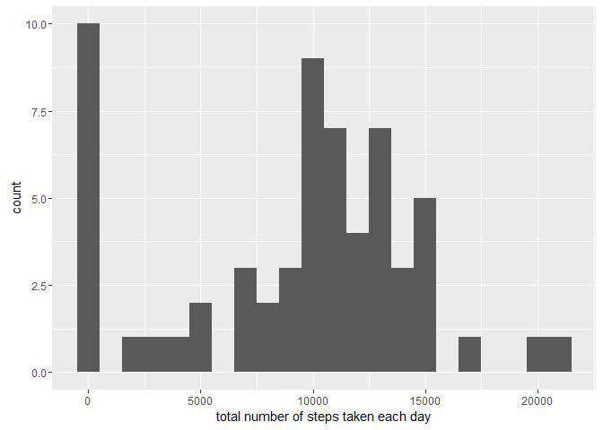
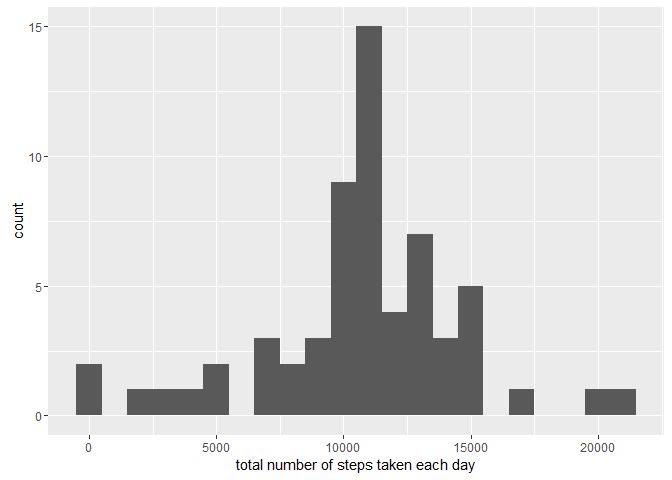

Reproducible Research: Peer Assessment 1
========================================

1. Code for reading in the dataset and/or processing the data
-------------------------------------------------------------

``` r
unzip(zipfile="repdata_data_activity.zip")
data <- read.csv("activity.csv")
```

2. Histogram of the total number of steps taken each day
--------------------------------------------------------

``` r
library(ggplot2)
total.steps <- tapply(data$steps, data$date, FUN=sum, na.rm=TRUE)
qplot(total.steps, binwidth=1000, xlab="total number of steps taken each day")
```



3. Mean and median number of steps taken each day
-------------------------------------------------

``` r
mean(total.steps, na.rm=TRUE)
```

    ## [1] 9354.23

``` r
median(total.steps, na.rm=TRUE)
```

    ## [1] 10395

4. Time series plot of the average number of steps taken
--------------------------------------------------------

``` r
library(ggplot2)
averages <- aggregate(x=list(steps=data$steps), by=list(interval=data$interval),
                      FUN=mean, na.rm=TRUE)
ggplot(data=averages, aes(x=interval, y=steps)) +
    geom_line() +
    xlab("5-minute interval") +
    ylab("average number of steps taken")
```


5. The 5-minute interval that, on average, contains the maximum number of steps
-------------------------------------------------------------------------------

``` r
averages[which.max(averages$steps),]
```

    ##     interval    steps
    ## 104      835 206.1698

6. Code to describe and show a strategy for imputing missing data
-----------------------------------------------------------------

``` r
missing <- is.na(data$steps)
table(missing)
```

    ## missing
    ## FALSE  TRUE 
    ## 15264  2304

``` r
fill.value <- function(steps, interval) {
    filled <- NA
    if (!is.na(steps))
        filled <- c(steps)
    else
        filled <- (averages[averages$interval==interval, "steps"])
    return(filled)
}
filled.data <- data
filled.data$steps <- mapply(fill.value, filled.data$steps, filled.data$interval)
```

7. Histogram of the total number of steps taken each day after missing values are imputed
-----------------------------------------------------------------------------------------

``` r
total.steps <- tapply(filled.data$steps, filled.data$date, FUN=sum)
qplot(total.steps, binwidth=1000, xlab="total number of steps taken each day")
```



``` r
mean(total.steps)
```

    ## [1] 10766.19

``` r
median(total.steps)
```

    ## [1] 10766.19

8. Panel plot comparing the average number of steps taken per 5-minute interval across weekdays and weekends
------------------------------------------------------------------------------------------------------------

``` r
weekday.or.weekend <- function(date) {
    day <- weekdays(date)
    if (day %in% c("Monday", "Tuesday", "Wednesday", "Thursday", "Friday"))
        return("weekday")
    else if (day %in% c("Saturday", "Sunday"))
        return("weekend")
    else
        stop("invalid date")
}
filled.data$date <- as.Date(filled.data$date)
filled.data$day <- sapply(filled.data$date, FUN=weekday.or.weekend)
```

8. Panel Plot
-------------

``` r
averages <- aggregate(steps ~ interval + day, data=filled.data, mean)
ggplot(averages, aes(interval, steps)) + geom_line() + facet_grid(day ~ .) +
    xlab("5-minute interval") + ylab("Number of steps")
```


